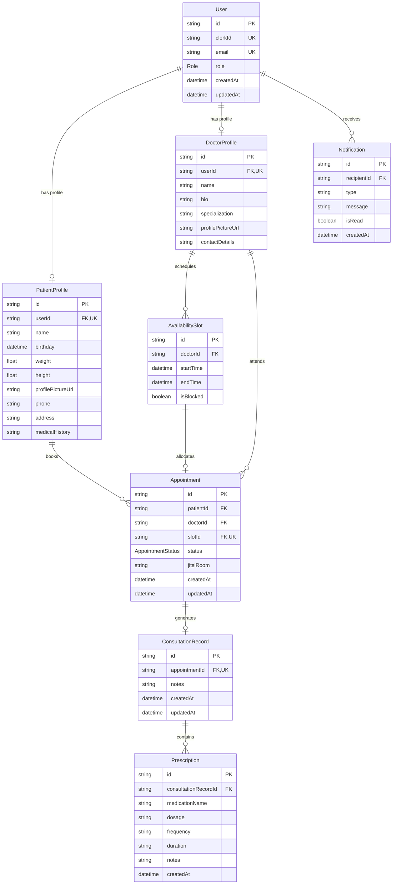

# Data Model

## Entities




## Schema

### User
```
id              String    @id @default(cuid())
email           String    @unique
passwordHash    String
role            Role      (PATIENT | DOCTOR)
createdAt       DateTime
updatedAt       DateTime
```
Central auth record. Thin — profile details live in the role-specific tables.

### PatientProfile
```
id              String
userId          String    @unique  FK → User
name            String
birthday        DateTime
weight          Float
height          Float
profilePictureUrl String?
phone           String?
address         String?
medicalHistory  String?
```

### DoctorProfile
```
id              String
userId          String    @unique  FK → User
name            String
bio             String?
specialization  String
profilePictureUrl String?
contactDetails  String?
```

### AvailabilitySlot
```
id              String
doctorId        String    FK → DoctorProfile
startTime       DateTime
endTime         DateTime
isBlocked       Boolean   @default(false)
```

### Appointment
```
id              String
patientId       String    FK → PatientProfile
doctorId        String    FK → DoctorProfile
slotId          String    FK → AvailabilitySlot
status          AppointmentStatus  (PENDING | CONFIRMED | CANCELLED | COMPLETED)
jitsiRoom       String?
createdAt       DateTime
updatedAt       DateTime
```

### ConsultationRecord
```
id              String
appointmentId   String    @unique  FK → Appointment
notes           String?
createdAt       DateTime
updatedAt       DateTime
```

### Prescription
```
id              String
consultationRecordId  String  FK → ConsultationRecord
medicationName  String
dosage          String
frequency       String
duration        String
notes           String?
createdAt       DateTime
```

### Notification
```
id              String
recipientId     String    FK → User
type            String
message         String
isRead          Boolean   @default(false)
createdAt       DateTime
```

---

## Design Decisions

### Separate PatientProfile and DoctorProfile instead of one unified profile table

The fields for patients (weight, height, medical history) and doctors (bio, specialization) are completely different. A unified table would have many nullable columns. Separate tables make each profile clean, independently queryable, and easier to extend without affecting the other role.

### AvailabilitySlot as a first-class entity

Availability could have been modeled as a simple schedule config (e.g., "Mondays 9–5"). A first-class `AvailabilitySlot` table was chosen instead because:
- Individual slot blocking is required (not just recurring patterns)
- Booked slots need to reference a specific slot ID on the Appointment
- Querying available slots for a date range is a simple `WHERE isBlocked = false AND id NOT IN (booked slots)`

### jitsiRoom stored on Appointment, not a separate table

A Jitsi room name is a short string (`appt-<uuid>`) generated once when the appointment is confirmed. There's no additional metadata to store, no lifecycle of its own, and no need to join to another table. Storing it directly on `Appointment` is the simplest correct approach.

### Appointment status uses an enum, not a boolean

Appointments have four meaningful states: `PENDING`, `CONFIRMED`, `CANCELLED`, `COMPLETED`. A boolean `isCancelled` or `isCompleted` cannot represent all states without ambiguity. An enum makes invalid states unrepresentable.

### No hard deletes on Appointments

Healthcare records should not disappear. Appointments are cancelled via status change, not deletion. This preserves the audit trail and ensures medical records remain accessible even after cancellation.

### Notification table vs. real-time only

Notifications are persisted to the database so the user can see their notification history on page load, not just receive events while connected. The Socket.io gateway delivers them in real time; the database is the source of truth for history.
