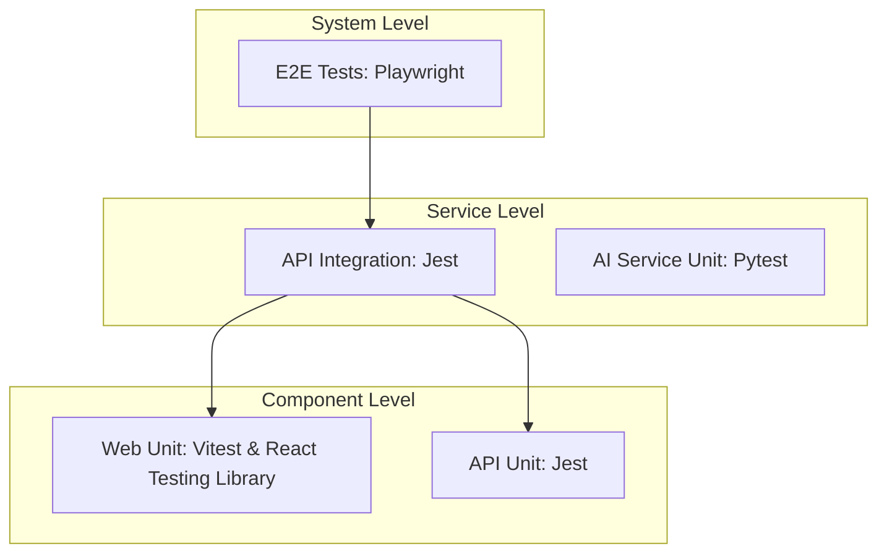

# LunaSol Testing Guide

This guide details the testing strategy, architecture, and instructions for running and writing tests in the LunaSol monorepo.

---

## 1. Testing Architecture & Stack

LunaSol uses a multi-tier testing setup to validate code at every level of the application stack.



| Scope | App Directory | Runner / Stack | Description |
|---|---|---|---|
| **Web Unit** | `apps/web` | Vitest, React Testing Library, JSDOM | Validates frontend component rendering, hooks, and State logic. |
| **API Unit** | `apps/api` | Jest, NestJS Testing Utilities | Validates NestJS controllers, services, and pipes in isolation. |
| **API Integration** | `apps/api` | Jest, Supertest | Validates REST endpoints, webhooks, and DB integration against a test database. |
| **AI Unit** | `apps/ai` | Pytest | Validates the FastAPI router, SSE streaming chain, and LlamaCpp integration. |
| **System E2E** | `apps/e2e-tests` | Playwright | Simulates real user flows across the integrated frontend, backend, and DB. |

---

## 2. Environment Setup

Before running tests, ensure you are in the testing branch or worktree directory (`/home/benn/lunasol-testing`).

### Node & PNPM
Install workspace dependencies:
```bash
pnpm install --no-frozen-lockfile
```

### Playwright Browsers (System E2E)
Playwright needs browser binaries installed on the host system to run:
```bash
pnpm --filter @lunasol/e2e exec playwright install --with-deps
```

### Python 3.14 Compatibility (AI Service)
If the host machine runs Python 3.14 (or similar newer version), `pydantic-core` compilation will fail to compile its Rust/`PyO3` bindings. Set the compatibility flag during installation:
```bash
cd apps/ai
source venv/bin/activate
PYO3_USE_ABI3_FORWARD_COMPATIBILITY=1 pip install -r requirements.txt
```

---

## 3. How to Run Tests

All test runners are orchestrated at the workspace level using Turborepo.

### Run All Tests
```bash
pnpm test
```
*Executes all unit, integration, and E2E suites defined in [turbo.json](file:///home/benn/lunasol-testing/turbo.json).*

### Run Specific Apps
* **Web Frontend:**
  ```bash
  pnpm --filter @lunasol/web run test
  ```
* **API Backend Unit:**
  ```bash
  pnpm --filter @lunasol/api run test
  ```
* **API Backend Integration (E2E):**
  ```bash
  pnpm --filter @lunasol/api run test:e2e
  ```
* **System E2E (Playwright CLI):**
  ```bash
  pnpm --filter @lunasol/e2e run test
  ```
* **System E2E (Playwright UI Mode):**
  ```bash
  pnpm --filter @lunasol/e2e run test:ui
  ```
* **AI Service (Pytest):**
  ```bash
  cd apps/ai && venv/bin/pytest
  ```

---

## 4. Best Practices & Writing New Tests

### Naming Conventions
* **Frontend**: Place tests adjacent to the component they test. Use `.test.ts` or `.test.tsx` (e.g. `AppointmentCard.test.tsx`).
* **API Unit**: Place tests adjacent to modules. Use `.spec.ts` (e.g. `auth.service.spec.ts`).
* **API Integration**: Put in the `apps/api/test/` directory. Use `.e2e-spec.ts`.
* **System E2E**: Put in `apps/e2e-tests/tests/`. Use `.spec.ts`.
* **Python AI Service**: Prefix or suffix files with `test_` (e.g. `test_main.py`).

### Mocking Guidelines
1. **Frontend**: Mock network requests using MSW (Mock Service Worker) or mock socket connections instead of actual network hits.
2. **API Unit**: Use NestJS testing module to mock DB providers (`PrismaService`) or external authentication APIs (`ClerkExpressWithAuth`).
3. **E2E Tests**: Use actual test databases where possible. Ensure tests clean up after themselves.
